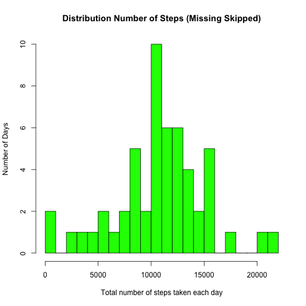
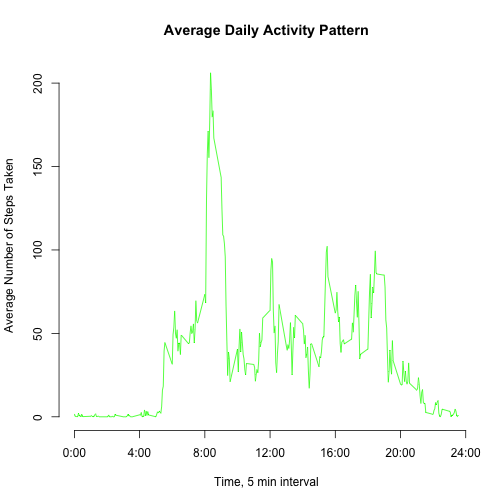
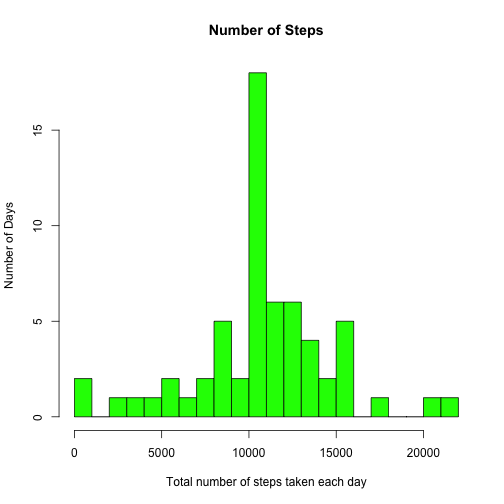
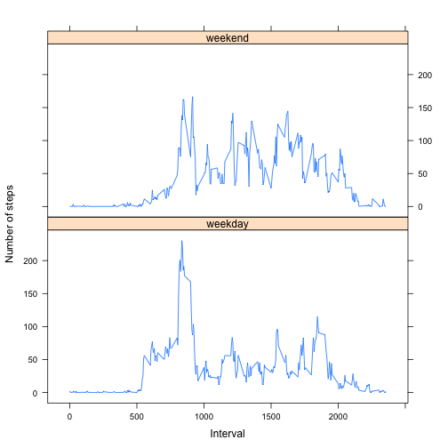

Reproducible Research (Project 1 activity data)
===============================================

###Loading and Processing the Data


```r
actdata <- read.csv("~/RepData_PeerAssessment1/activity.csv", header = T)
summary(actdata)
```

```
##      steps                date          interval     
##  Min.   :  0.00   2012-10-01:  288   Min.   :   0.0  
##  1st Qu.:  0.00   2012-10-02:  288   1st Qu.: 588.8  
##  Median :  0.00   2012-10-03:  288   Median :1177.5  
##  Mean   : 37.38   2012-10-04:  288   Mean   :1177.5  
##  3rd Qu.: 12.00   2012-10-05:  288   3rd Qu.:1766.2  
##  Max.   :806.00   2012-10-06:  288   Max.   :2355.0  
##  NA's   :2304     (Other)   :15840
```

####Create a data subset with NA removed


```r
actdataNaOmit <- subset(actdata, is.na(actdata$steps) == F)
```

###Find the mean total number of steps taken per day.

####calculating the total number of steps taken each day


```r
library(plyr)
totalPerDay <- ddply(actdataNaOmit, .(date), summarise, steps = sum(steps))
```

####creating the histogram


```r
hist(totalPerDay$steps, breaks = 24, main = "Distribution Number of Steps (Missing Skipped)", xlab = "Total number of steps taken each day", 
    ylab = "Number of Days", col = "green")
```

 

####Calculate and report the mean and median total number of steps taken per day

mean

```r
mean(totalPerDay$steps)
```

```
## [1] 10766.19
```

median

```r
median(totalPerDay$steps)
```

```
## [1] 10765
```

###Average daily activity pattern

####Make a time series plot (i.e. type = "l") of the 5-minute interval (x-axis) and the average number of steps taken, averaged across all days (y-axis)

calcluating the average number of steps taken in each 5-minite intervals

```r
averagePerInterval <- ddply(actdataNaOmit, .(interval), summarise, steps = mean(steps))
```
creating the plot

```r
plot(averagePerInterval$interval, averagePerInterval$steps, axes = F, type = "l", 
    col = "green", xlab = "Time, 5 min interval", ylab = "Average Number of Steps Taken", main = "Average Daily Activity Pattern")
axis(1, at = c(0, 400, 800, 1200, 1600, 2000, 2400), label = c("0:00", "4:00", "8:00", "12:00", 
    "16:00", "20:00", "24:00"))
axis(2)
```

 

####Which 5-minute interval, on average across all the days in the dataset, contains the maximum number of steps?

```r
averagePerInterval[which.max(averagePerInterval$steps), ]
```

```
##     interval    steps
## 104      835 206.1698
```

The interval 8:35 contains the maximum number of steps.

###Imputing missing values

####Calculate and report the total number of missing values in the dataset (i.e. the total number of rows with NAs)

```r
sum(is.na(actdata$steps))
```

```
## [1] 2304
```

Devise a strategy for filling in all of the missing values in the dataset. The strategy does not need to be sophisticated.

From the assignment hint, the 5 minute interval mean will be used.

####Create a new dataset that is equal to the original dataset but with the missing data filled in.

```r
imputed <- actdata

for (i in 1:nrow(imputed)) {
    if (is.na(imputed$steps[i])) {
        imputed$steps[i] <- averagePerInterval$steps[which(imputed$interval[i] == 
            averagePerInterval$interval)]
    }
}

imputed <- arrange(imputed, interval)
```
####Make a histogram of the total number of steps taken each day and Calculate and report the mean and median total number of steps taken per day.

calculating the total number of steps taken each day

```r
totalPerDayImputed <- ddply(imputed, .(date), summarise, steps = sum(steps))
```
creating the plot

```r
hist(totalPerDayImputed$steps, breaks = 24, main = "Number of Steps", xlab = "Total number of steps taken each day", 
    ylab = "Number of Days", col = "green")
```

 

Calculate and report the mean and median total number of steps taken per day on the imputed dataset

mean

```r
mean(totalPerDayImputed$steps)
```

```
## [1] 10766.19
```

median

```r
median(totalPerDayImputed$steps)
```

```
## [1] 10766.19
```

Compare to see if these values differ from the first part

mean comparison

```r
abs(mean(totalPerDay$steps) - mean(totalPerDayImputed$steps))
```

```
## [1] 0
```
median comparison

```r
abs(median(totalPerDay$steps) - median(totalPerDayImputed$steps))/median(totalPerDay$steps)
```

```
## [1] 0.0001104207
```

The new mean is 10766 and the new median is 10766 with the missing values filled in. Compared with the original mean 10766 and median 10765, the mean is the same and the median changed by ~0.1 per cent.

The new histogram has more results in the center than the first histogram.

test how total steps taken per day differ

```r
totalDifference <- sum(imputed$steps) - sum(actdataNaOmit$steps)
totalDifference
```

```
## [1] 86129.51
```

The total steps increased.

###Are there differences in activity patterns between weekdays and weekends?

####Create a new factor variable in the dataset with two levels -- "weekday" and "weekend" indicating whether a given date is a weekday or weekend day.


```r
imputed$weekdays <- weekdays(as.Date(imputed$date))
imputed$weekdays <- ifelse(imputed$weekdays %in% c("Saturday", "Sunday"), "weekend", 
    "weekday")
```
####Make a panel plot containing a time series plot (i.e. type = "l") of the 5-minute interval (x-axis) and the average number of steps taken, averaged across all weekday days or weekend days (y-axis).

calcluating the average for each interval

```r
average <- ddply(imputed, .(interval, weekdays), summarise, steps = mean(steps))
```
creating the plot

```r
library(lattice)
xyplot(steps ~ interval | weekdays, data = average, layout = c(1, 2), type = "l", 
    xlab = "Interval", ylab = "Number of steps")
```

 
